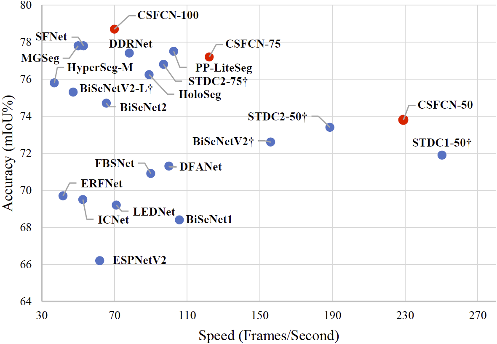
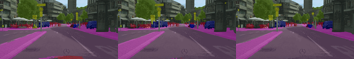
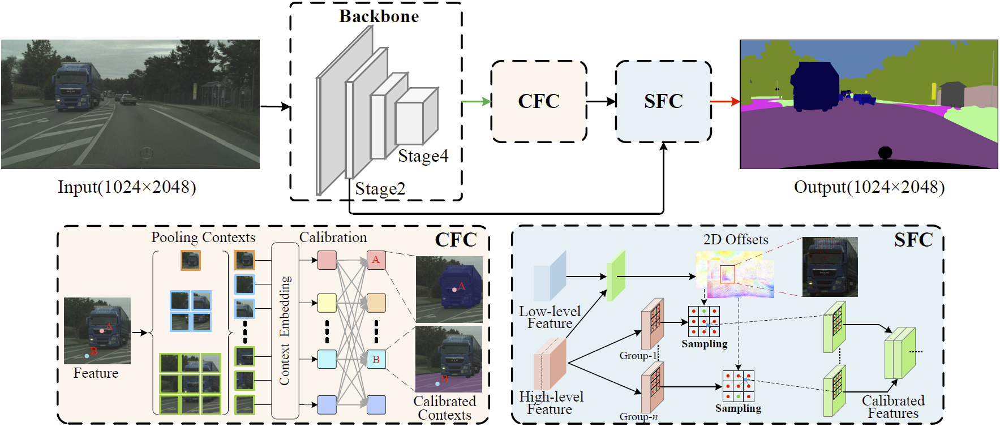
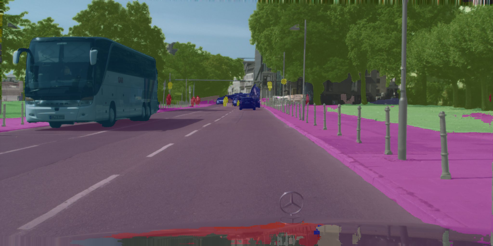

# Context and Spatial Feature Calibration for Real-Time Semantic Segmentation
[](https://opensource.org/licenses/MIT)
[](https://github.com/kaigelee/CSFCN)
[](https://github.com/kaigelee/CSFCN)

By Kaige Li, Qichuan Geng, Maoxian Wan, Xiaochun Cao, Senior Member, IEEE, and Zhong Zhou. This repository is an official implementation of the paper "Context and Spatial Feature Calibration for Real-Time Semantic Segmentation", which is under review. The full code will be released after review.

We have open sourced the original network files, but the overall project still needs to be refactored, which is what we will do in the future.

## 🔥 Highlights
<p align="center">
  </br>
  <span align="center">Comparison of inference speed and accuracy for real-time models on test set of Cityscapes.</span> 
</p>

* **Towards Real-time Applications**: S2FCN could be directly used for the real-time applications, such as autonomous vehicle and medical imaging.
* **A Novel and Efficient Decoder**: a Context and Spatial Decoder is introduced to deal with the problems of pixel-context mismatch and spatial
feature misalignment via pooling-based and sampling-based attention mechanisms.
* **More Accurate and Faster**: CSFCN presents 78.7% mIOU with speed of 70.0 FPS on Cityscapes test set and 77.8% mIOU with speed of 179.2 FPS on CamVid test set.

## 🎉 Updates 
   - Our paper is undergoing a second peer review. In the meantime, we have prepared a preprint and will post a link to it soon. (Aug/06/2023)
   - The overview, training logs, and some codes for CSFCN are available here. (Aug/08/2023)
   - We reproduced the network files of [SFANet](https://ieeexplore.ieee.org/abstract/document/9583294) and [MGSeg](https://ieeexplore.ieee.org/abstract/document/9511235) for comparison with them. (Aug/16/2023)
   - We validate the validity of our reproductions, which achieve comparable performance to those in the original paper. (Aug/19/2023)
   - We’ve updated how to use TensorRT to accelerate network inference. (Sep/26/2023)
   - We find the design of *Real-Time Single Image and Video Super-Resolution Using an Efficient Sub-Pixel Convolutional Neural Network, CVPR 2016* could further improve performance, so we recommend using it to build networks. (Sep/27/2023)
   - We open sourced pixelshuffle-based [CSFCN](https://github.com/kaigelee/CSFCN/blob/main/models/csfcn.py) and [CSFCN-Tiny](https://github.com/kaigelee/CSFCN/blob/main/models/csfcn_tiny.py). Please note that some hyperparameters of the module still need to be standardized, which we are working on. (Nov/29/2023)


## Demos

A demo of the segmentation performance of our proposed CSFCNs: Predictions of CSFCN-100 (left), CSFCN-75 (middle), and CSFCN-50 (right).
<p align="center">
  </br>
  <span align="center">Cityscapes Stuttgart demo video #0</span>
</p>

<p align="center">
  </br>
  <span align="center">Cityscapes Stuttgart demo video #1</span>
</p>

<p align="center">
  </br>
  <span align="center">Cityscapes Stuttgart demo video #2</span>
</p>

## Overview
<p align="center">
  </br>
  <span align="center">An overview of the basic architecture of our proposed Context and Spatial Feature Calibration Network (CSFCN). </span> 
</p>
CFC and SFC blocks are responsiable for context feature calibration, spatial feature calibration, respectively.

## Metrics

:bell: We append 50, 75 and 100 after the network name to represent the input sizes of 512 × 1024, 768 × 1536 and 1024 × 2048, respectively.

| Model (Cityscapes) | Val (% mIOU) |Test (% mIOU)| FPS (GTX 1080 Ti) | FPS (RTX 2080<br>Super Max-Q) |
|:-:|:-:|:-:|:-:|:-:|
| CSFCN-50 | 74.0 | 73.8 | 229.1 | 114.2 | 
| CSFCN-75 | 77.3 |77.2 | 122.2  | 65.9 |
| CSFCN-100 | 79.0 |78.7 | 70.0 |  38.1|

:bell: Our Cityscapes pre-trained CSFCN obtains 81.0% mIoU on the CamVid set.
 
| Model (CamVid) | Val (% mIOU) | Test (% mIOU)| FPS (GTX 1080 Ti) | FPS (RTX 2080 Super Max-Q) |
|:-:|:-:|:-:|:-:|:-:|
| CSFCN |-| 77.8 | 179.2 | 101.8 | 
| CSFCN-P |-| 81.0 | 179.2 | 101.8 | 

:smiley_cat: The inference time is measured under torch 1.7.1, CUDA 11.0, and CUDNN 7.6.5 on a single NVIDIA GTX 1080Ti GPU card with a batch size 1.

:smiley_cat: Our method can still maintain better real-time performance on RTX 2080 Super Max-Q.


## Setup Environment

For this project, we used python 3.8.5. We recommend setting up a new virtual
environment:

```shell
python -m venv ~/venv/CSFCN
source ~/venv/CSFCN/bin/activate
```

In that environment, the requirements can be installed with:

```shell
pip install -r requirements.txt -f https://download.pytorch.org/whl/torch_stable.html
```


## Usage

### 0. Prepare the dataset

* Download the [Cityscapes](https://www.cityscapes-dataset.com/) and [CamVid](http://mi.eng.cam.ac.uk/research/projects/VideoRec/CamVid/) datasets and unzip them in `data/cityscapes` and `data/camvid` dirs.


### 1. Training

* Download the ImageNet pretrained models and put them into `pretrained_models/imagenet/` dir.
* For example, train the CSFCN on Cityscapes with batch size of 12 on one GPU (e.g., 3090):
````bash
python train.py --cfg configs/CSFCN_cityscapes.yaml
````
* Or train the CSFCN on Cityscapes using train and val sets simultaneously with batch size of 12 on one GPU:
````bash
python trainval.py --cfg configs/CSFCN_cityscapes_trainval.yaml
````

### 2. Evaluation

* Download the finetuned models for Cityscapes and CamVid and put them into `pretrained_models/cityscapes/` and `pretrained_models/camvid/` dirs, respectively.
* For example, evaluate the CSFCN on Cityscapes val set:
````bash
python tools/eval.py --cfg configs/CSFCN_cityscapes.yaml \
                          TEST.MODEL_FILE pretrained_models/cityscapes/CSFCN_best_model.pt
````
* Or, evaluate the CSFCN on CamVid test set:
````bash
python tools/eval.py --cfg configs/CSFCN_camvid.yaml \
                          TEST.MODEL_FILE pretrained_models/camvid/CSFCN_camvid_best_model.pt
````
* Generate the testing results of CSFCN on Cityscapes test set:
````bash
python tools/submit.py --cfg configs/CSFCN_cityscapes_trainval.yaml \
                          TEST.MODEL_FILE pretrained_models/cityscapes/CSFCN_trainval_best_model.pt 
````

### 3. Speed Measurement

#### 3.0 Latency measurement tools

* If you have successfully installed [TensorRT](https://github.com/chenwydj/FasterSeg#installation), you will automatically use TensorRT for the following latency tests (see [function](https://github.com/chenwydj/FasterSeg/blob/master/tools/utils/darts_utils.py#L167) here).
* Or you can implement TensorRT inference based on the guidance of [torch2trt](https://nvidia-ai-iot.github.io/torch2trt/master/usage/basic_usage.html). (recommended)  🔥
* Otherwise you will be switched to use Pytorch for the latency tests  (see [function](https://github.com/chenwydj/FasterSeg/blob/master/tools/utils/darts_utils.py#L184) here).

#### 3.1 Measure the speed of the CSFCN

* Measure the inference speed of CSFCN-100 for Cityscapes:
````bash
python models/speed/CSFCN_speed.py --c 19 --r 1024 2048
````
* Measure the inference speed of CSFCN for CamVid:
````bash
python models/speed/CSFCN_speed.py --c 11 --r 720 960
````

### 4. Custom Inputs

* Put all your images in `samples/` and then run the command below using Cityscapes pretrained CSFCN for image format of .png:
````bash
python tools/custom.py --p '../pretrained_models/cityscapes/CSFCN_best_model.pth' --t '*.png'
````

You should end up seeing images that look like the following:

<p align="center">
  </br>
  <span align="center">Custom Output. </span> 
</p>


## TODO
- [ ] Refactor and clean code
- [ ] Organize all codes and upload them
- [ ] Release complete config, network and training files

## Model Zoo

For fair comparison, we have reproduced some related methods.

<details open>
<summary>Methods:</summary>

- [x] [SFANet (T-ITS'2021)](models/SFANet.py)
- [x] [MGSeg (TIP'2021)](models/MGSeg.py)
- [x] [ICNet (ECCV'2018)](models/icnet.py)

</details>

<details open>
<summary>Links:</summary>

- [x] [SwiftNet (PR'2021)](https://github.com/orsic/swiftnet)
- [x] [BiSeNet (ECCV'2018, IJCV'2021)](https://github.com/CoinCheung/BiSeNet)

</details>

In the future, we will open source the codes of more real-time semantic segmentation methods  (e.g., [MSFNet](https://arxiv.org/abs/1911.07217)).

## Acknowledgements

This project is based on the following open-source projects. We thank their
authors for making the source code publically available.

* [ICNet-pytorch](https://github.com/liminn/ICNet-pytorch)
* [PIDNet](https://github.com/XuJiacong/PIDNet)
* [DDRNet](https://github.com/ydhongHIT/DDRNet)

